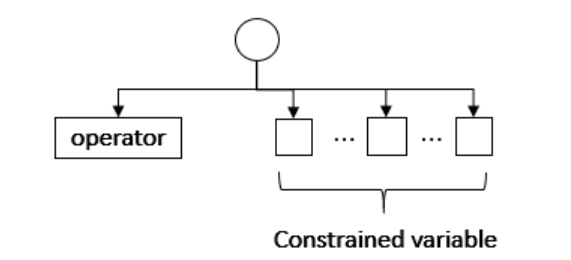

Fuzzing Code Design

> 让我们思考一下创建一个method的创建流程
>
> 为了避免描述误差: 我们将一个方法成为method, 将method, block, while/for等统称为一个function.

**Create a method Tree**

1. Random a method name

2. Maybe random some parameters (primitive type ! !)

   - This is the rule of this method.

3. Choose special BlockOperator **block** (named it as special block).

    (Consider: block is  really special ! We need it when using while/for/create method..)

4. Random some variables, BlockOperator, MethodOperator.

   > 在这里, 我们考虑:
   >
   > BlockOperator: 循环块(while/for/..), 选择块(if/ else/ ..).
   >
   > Method Operator: Method(parameter1, parameter2, ..), primitive pool: + - * %
   >
   > 为什么这么分类呢? 考虑到循环块较为特殊, 它的rule一般为boolean语句+special block. 如果对它做约束处理, 那么rule中的typelist就是[boolean,special block], 那我们是不是又要对special block做一个处理呢? 因为遇到它时代表后面可以添加无数语句... (我们不得不这么考虑, 因为它必要的boolean设计及special block, 而它除此外, 没有必要的request Type list. 这会是rule非常单一, 且在同层内多重处理会变得麻烦. )
   >
   > Method Operator的rule通常为一系列某种Type的参数.我们调用method并且传参.
   >
   > 
   >
   > 简单来说就是 对它们两种类型的约束处理是不一样的 ! 

   - variables lists : every variable packets as a Node. 

   > 后面看Node作为一棵树的节点它能够提供什么信息.

   - Block pool lists: packet as a Node. 

     - **iteration: step 3, 4.** (We can count the number of nested...)

   - Method pool lists: packet as a Node .

     三类: 每类都可以进行循环操作处理list中的每一个元素. (具体如何处理看实现)

5. May be random or choice a return ??? (return Type for this Operator)

> 现在我们创建了个一个有method name的子树, 我们可以将该method添加到MethodOperator Pool中, 可以被其他的方法调用. 


> 具体分析一下怎么设计程序框架: interface, abstract, implement method, enum, class ..

````
class Node{
	boolean isFunc;
	// 这个变量可以让我们知道应该从node中找到哪些信息, 比如它如果是一个function, 它本身是空的,但它有子节点, 它的一个子节点是operator name. 如果它不是function, 那么它会记录type, value. 这个我们可以根据三个类型再进行考虑.
	String Type; 
	// 考虑用enum, 但是虽然我们目前做primitive, 但是后期说不定会增添自造的声明类型呢?
	// Type 可以记录变量类型也可以记录方法的return type.
	String name;
	// variable本身有name.
	T Value;
	// Node记载了当前的值. 
	Node[];
	// 子节点
}
````


```
class Operator{
	String Type; // String, integer, char.....
	Rule rule;
	String value; // pool: {} +-*/% < > = ..
	//不care value执行的操作: 根据树输出java code 文本文档... (It's string!)
}

Enum BlockOperatorEnum
class BlockOperatorPool{
	getRandomBlock
}
method createBlockPool(e:  BlockOperatorEnum)

Enum PrimitiveMethodOperEnum
class MethodOpertorPool{
	getRandomMethod()
}
method createPrimitiveMethodPool(e: PrimitiveMethodOperEnum)
```


```
class TypeOperatorDict{
	static findTypeByOperator(String OperatorName)
	static findOperatorByType()
}
```

```
class Rule{
	String[] Typelist;
	getallTypes;
}
```


### IMPORTANT

I write some classes and methods in this project through the above analysis, and **Add description for some classes** . But I wrote it  rush , there maybe something uncorrect. 

ALSO, if you change the structure of it, please add a document to explain why you design like what you do. 